## CSS

- Definisi css

Apa itu css

  <div align="justify">CSS adalah bahasa komputer yang digunakan untuk menambahkan design ke suatu halaman website di internet agar terlihat lebih cantik/menarik. CSS adalah singkatan dari Cascading Style Sheets. Kita ibaratkan HTML adalah kerangka yang memberi sturuktur pada website, maka CSS adalah baju yang memberi warna dan layout pada website.

&nbsp;

- Cara Menggunakan CSS

  1. Inline Styles

     Kita menambahkann CSS langsung pada atribut HTML

     ```html
     <p style="color:red">Tulisan ini berwarna merah</p>
     ```

     

  &nbsp;

  2. Internal CSS

     Kita menggunakan element/tag `<style>` untuk menyisipkan kode CSS. element/tag `<style>` diletakkan di dalam element `<head>`

     ```html
     <!DOCTYPE html>
     <html>
       <head>
         <title>Website Pertamaku</title>
         <style>
           body {
             background-color: yellow;
           }
           h1 {
             color: blue;
           }
           p {
             color: red;
           }
         </style>
       </head>
       <body>
         <h1>Website Pertamaku</h1>
         <p>Selamat Datang</p>
       </body>
     </html>
     ```

     Tampilan dari sintaks diatas adalah

     

     &nbsp;

  3. Eksternal CSS

     <div align="justify">Kita akan menyisipkan kode CSS dengan cara membuat file CSS terpisah, dan lalu menyambungkannya dengan file HTML dengan menggunakan element <link>. Element <link> tersebut diletakkan di dalam element <head>

     Contoh:

     <div align="justify">Kita memiliki dua file: index.html untuk file HTML-nya dan styles.css untuk file CSS-nya.

     ```html
     <!-- File index.html -->

     <!DOCTYPE html>
     <html>
       <head>
         <title>Website Pertamaku</title>
         <link rel="stylesheet" href="styles.css" />
       </head>
       <body>
         <h1>Website Pertamaku</h1>
         <p>Selamat Datang</p>
       </body>
     </html>
     ```

     ```css
     /* File styles.css */

     body {
       background-color: pink;
     }
     h1 {
       color: blue;
     }
     p {
       color: black;
     }
     ```

     Tampilan dari sintaks diatas adalah

     

     &nbsp;

- CSS Syntax

  <div align="justify">CSS Syntax adalah syntax yang digunakan untuk menunjuk atau memilih HTML element mana yang ingin diberi style (dihias). CSS syntax terdiri dari selector, property, dan value.

  Syntaxnya seperti ini:

  ```css
  p {
    color: blue;
  }
  ```

  Penjelasan :

  - p

    Adalah sebuah selector berupa element HTML yang akan diubah

  - color

    <div align="justify">Adalah sebuah properti berupa bagian mana dari element HTML yang akan diubah. Contoh diatas kita akan mengubah warna dari teks yang ada di element p

  - blue

    Adalah value yaitu nilai/hiasan berupa warna biru

  &nbsp;

- CSS Selektor

    <div align="justify">Untuk Mengenal lebih dalam mengetahhui kombinasi yang ada pada css selector

  ```css
  * {
    background-color: green;
  }
  ```

  maka akan tampil seperti dibawah ini

  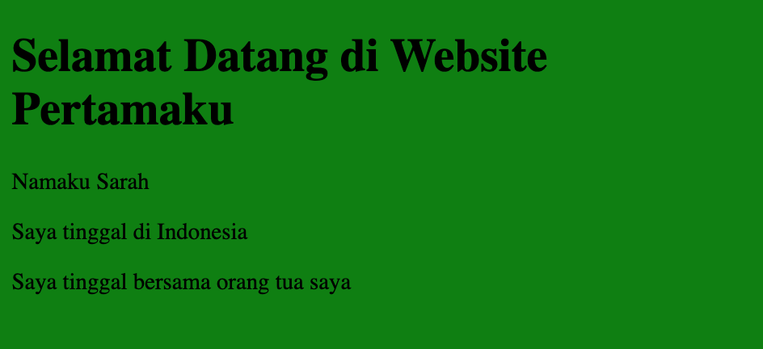

  atau kita juga bisa menunjuk element yang ada dalam suatu element

  ```css
  div * {
  background-color: yellow;
  ```

  maka akan tampil seperti dibawah ini
  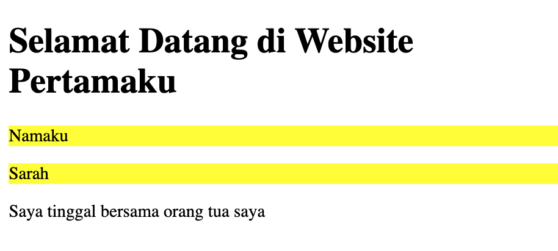

- Pseudo-class & Pseudo-Element

  pseudo class digunakan untuk mendefinisikan kedaan khusus pada suatu element seperti :

  1-Memberikan style pada link pada saat di-hover

  2-Memberikan style pada link setelah di-klik (dikunjungi)

  3-Memberikan style pada checkbox setelah dicentang

  ada banyak sekali pseudo class seperti

  -hover, contohnya dibawah ini

  ```css
  <!-- Pada File HTML -->
  <body>
  <h1>Saya</h1>
  <h1>Sangat</h1>
  <h1>Ingin Liburan</h1>
  <h1>Sejenak</h1>
  </body>
  /* Pada File CSS */
  h1:hover {
    background: black;
    color: white;
  }
  ```

  maka akan tampil sperti ini

  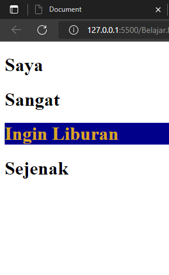

- Css Box Model

  css itu seperti box yang terdiri dari

  -margin

  -border

  -padding

  -conntent

  contoh :

  ```css
  <!DOCTYPE html>
  <html>
  <head>
    <style>
      p {
        background-color: lightgrey;
        width: 300px;
        height: 100px;
        border: 15px solid black;
        padding: 50px;
        margin: 20px;
      }
    </style>
  </head>
  <body>
    <h2>Contoh Box Model</h2>

    <p>
        Tulisan ini adalah konten dari box. Konten sendiri memiliki lebar
        (width) sebesar 300px dan tinggi (height) sebesar 100px. Pada box, kita
        menambahkan padding sebesar 50px, border berwarna hitam sebesar 15px,
        dan margin sebesar 20px.
    </p>
  </body>
  </html>
  ```

  contoh box Model

  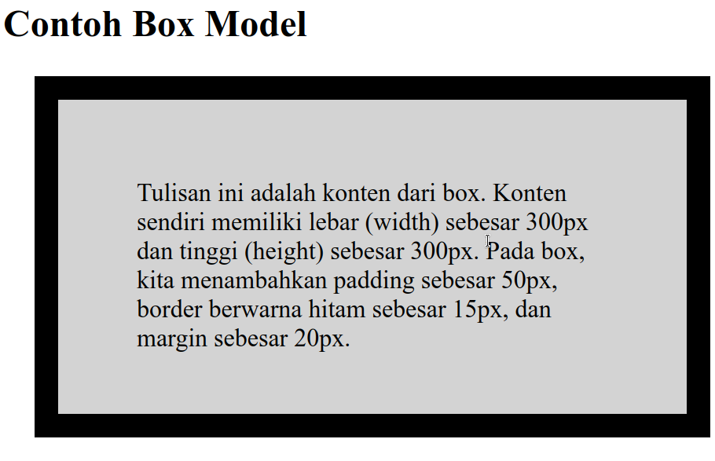

- CSS Display

  -css display adalah satu yang sering digunakan dalam pengembangan web yang terbagi ke dalam 2 yaitu none dan visibilty hidden

  -display block

  ```css
  <!-- Pada File HTML -->
  <body>
  <span>Element paragraf adalah</span>
  <span>block-level element</span>
  <span>Ia akan menempati</span>
  <span>satu baris penuh</span>
  </body>
  /* Pada File CSS */
  span {
    display: block;
  }
  ```

  maka akan tampil sperti dibawah ini

  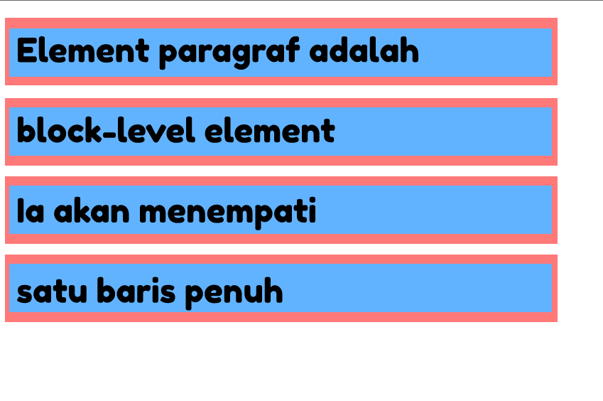

  -display inline

  keberadaan display inline ini membuat ukuran box dari element tidak lagi sebaris penuh

  contoh

  ```css
    <!DOCTYPE html>
  <html>
    <head>
      <style>
        .green-text {
          background: lightgreen;
        }
        .blue-text {
          background: lightblue;
        }
      </style>
    </head>
    <body>
      <p class="green-text">Teks dengan latar b elakang hijau</p>
      <p class="blue-text">Teks dengan latar belakang biru</p>
      <span class="green-text">Teks dengan latar belakang hijau</span>
      <span class="blue-text">Teks dengan latar belakang biru</span>
    </body>
  </html>
  ```

  maka akan tampil seperti di bawah ini
  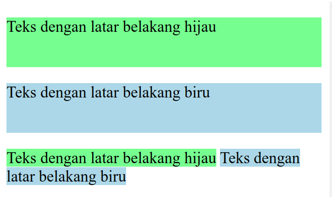

  -display inline-box

  memiliki property yang bisa mengatur lebar dan tingginya

  contoh

  ```css
  //html

  <body>
    <h1 id="demo1">Mumet</h1>
    <h1 id="demo2">Karena Banyak Tugas</h1>
  </body>

  <style>
  h1 {
    display: inline-block;
    background: lightblue;
  }
  #demo1 {
    width: 150px;
    height: 100px;
  }
  #demo2 {
    width: 200px;
    height: 150px;
  }
  </style>
  ```

  maka akan tampil seperti dibawah ini

  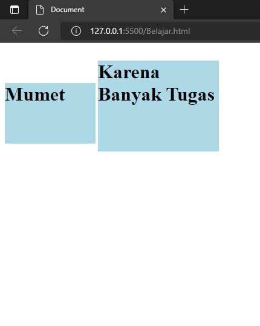

- CSS POSITION

  Terdiri dari position static: tidak terpengaruh oleh properti top

  contoh

  ```css
  *//html

  <div class="container">
      <div class="yellow-boxes" style="top: 20px;"></div>
      <div class="yellow-boxes" style="right: 20px;"></div>
      <div class="yellow-boxes" style="bottom: 20px;"></div>
      <div class="yellow-boxes" style="left: 20px;"></div>
    </div>

    *//css internal

    <style>
      .container {
        background: lightgreen;
        width: 600px;
        height: 150px;
      }

      .yellow-boxes {
        display: inline-block;
        margin: 10px;
        background: yellow;
        width: 100px;
        height: 100px;
      }
    </style>

  ```

  maka akan tampil seperti ini

  

  relaive : Element lain di sekitar element dengan posisi relative tidak akan disesuaikan dengan ruang yang ditinggalkan oleh element

  contoh

  ```css
  //html

  <div class="inline-block"></div>
    <div class="inline-block relative"></div>
    <div class="inline-block"></div>  
  
    //css external
   .relative {
    position: relative;
    top: 40px;
  }
  ```

  maka akan tampil gambar seperti dibawah ini

  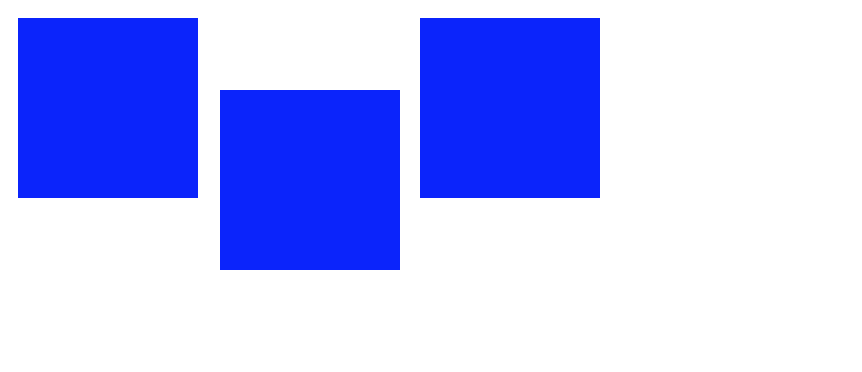

  absolute :
  Element dengan posisi absolute akan diposisikan relative dengan posisi ancestor terdekat yang posisinya bukan static

  contoh

  ```css
  //html
  <div class="big-square">
  	<div class="medium-square">
  		<div class="small-square"></div>
  	</div>
  </div>

  //css internal
  <style>
  	.small-square {
  		position: absolute;
  		right: 0;
  		height: 80px;
  		width: 80px;
  		background: yellow;
  	}

  	.medium-square {
  		height: 200px;
  		width: 300px;
  		background: red;
  	}

  	.big-square {
  		position: relative;
  		height: 400px;
  		width: 400px;
  		background: deepskyblue;
  	}
  </style>
  ```

  maka akan tampil seperti ini

  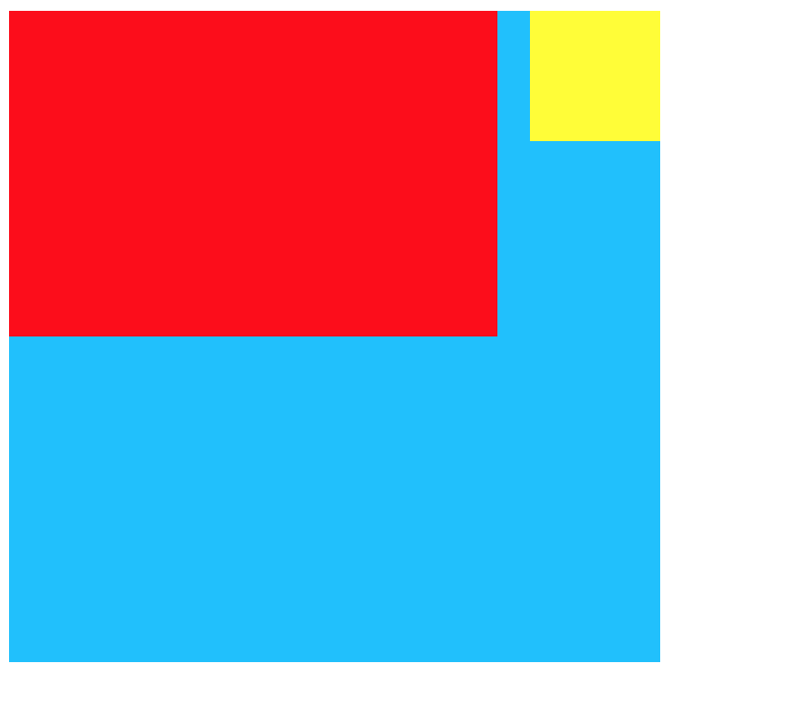

  fixed : posisi fixed akan diposisikan relatif terhadap viewport browser, di mana akan selalu berada di tempat yang sama jika walaupun halaman website di-scroll.

  contoh

  ```css
  //html

   <p>
      Lorem ipsum dolor sit amet, consectetur adipiscing elit, sed do eiusmod
      tempor incididunt ut labore et dolore magna aliqua. Ut enim ad minim
      veniam, quis nostrud exercitation ullamco laboris nisi ut aliquip ex ea
      commodo consequat. Duis aute irure dolor in reprehenderit in voluptate
      velit esse cillum dolore eu fugiat nulla pariatur. Excepteur sint occaecat
      cupidatat non proident, sunt in culpa qui officia deserunt mollit anim id
      est laborum.
    </p>
    <div class="fixed">
      This div element has position: fixed;
    </div>

    //css internal
    <style>
      div.fixed {
        position: fixed;
        top: 100px;
        width: 300px;
        padding: 10px 20px;
        background: #73ad21;
      }
    </style>
  ```

  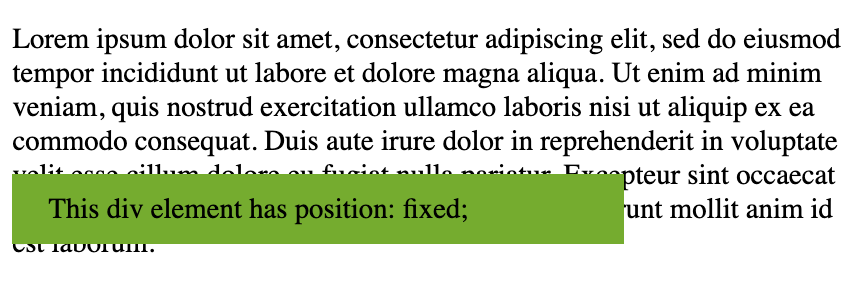

  sticky : posisi sticky akan diposisikan berdasarkan scroll halaman dari user.position:sticky pada dasarnya adalah seperti gabungan dari position:relative dan position: fixed

  contoh

  ```css
  <p>Cobalah scroll halaman website ini</p>

    <div class="sticky">I am sticky!</div>

    <p class="content">
      Lorem ipsum dolor sit amet, consectetur adipiscing elit, sed do eiusmod
      tempor incididunt ut labore et dolore magna aliqua. Ut enim ad minim
      veniam, quis nostrud exercitation ullamco laboris nisi ut aliquip ex ea
      commodo consequat. Duis aute irure dolor in reprehenderit in voluptate
      velit esse cillum dolore eu fugiat nulla pariatur. Excepteur sint occaecat
      cupidatat non proident, sunt in culpa qui officia deserunt mollit anim id
      est laborum.
    </p>

    </div>

    //css internal

    <style>
      .sticky {
        position: sticky;
        top: 30px;
        padding: 5px;
        background-color: yellow;
        border: 2px solid blue;
      }
      p.content {
          height: 100vh
      }
    </style>
  ```

  maka akan tampil sperti

  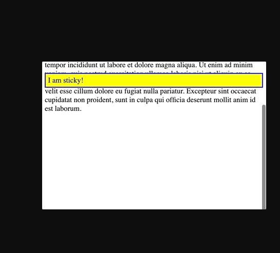

- Mengatur viewport

  Secara umum viewport adalah daerah pada layar yang menampilkan suatu konten. Dalam konteks kita kali ini, tentu viewport adalah daerah yang menampilkan halaman web yang sedang kita akses dan tidak selalu sesuai dengan layar

  ada beberapa bagian yaitu yang pertama Mengguunakan presentasi nilai lebar Element

  kedua : menggunakan property max width

  ketiga menggunakan stuan unit

  keempat menggunakan media querry

  kelima menggunakan element flexbox
