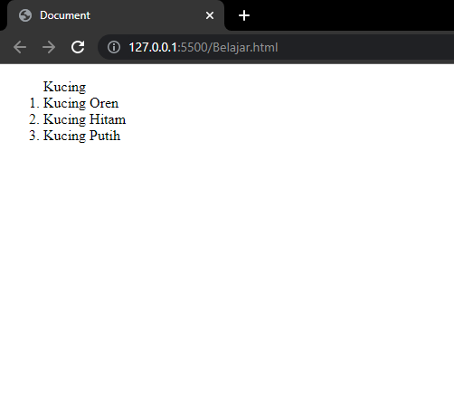
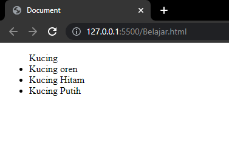
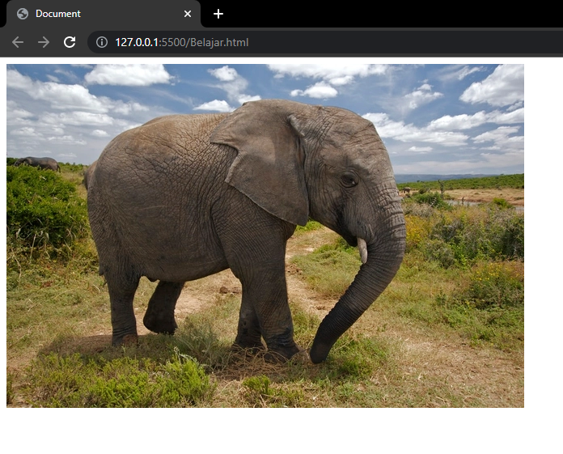
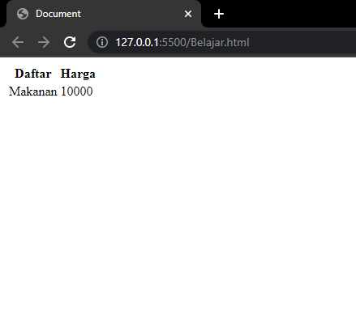
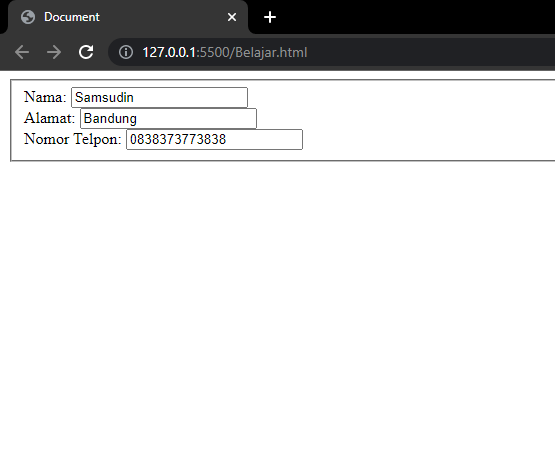
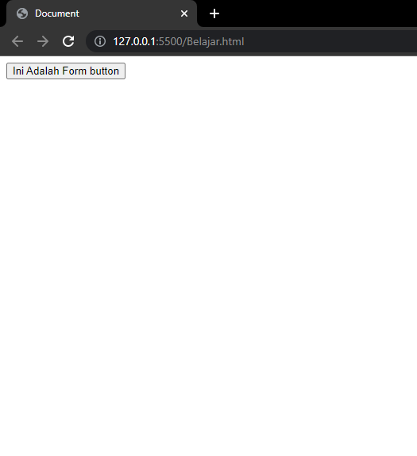
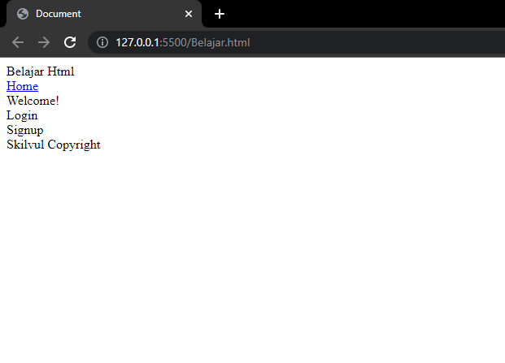

# **Rangkuman Week 1**

## HTML

Pengenalan Html :
apa itu HTML ?
Html adalh singkatan dari hyper text markup language yang mana html ini bisa diibaratkan seperti kerangka dan css seperti kulit atau bajunya kemudian javascript kita ibaratkan seperti otot yang bisa menggerakan datau memfungsikan kerangka tadi yang kita buat

## Pengenalan

- Html Tag
- Html Element
- Html Attribute
- Html Comment

## HTML

- Definisi HTML

  <div align="justify">Merupakan bahasa komputer yang digunakan untuk membuat kerangka atau struktur untuk Web pages (halaman website) di internet. Bagaimana peran HTML pada web development? Web browser seperti Chrome, Firefox, Edge, Safari, atau Opera akan membaca dokumen HTML. Dokumen HTML yang berisi tag-tag HTML akan memberitahu browser bagaimana cara menampilkan sebuah konten.

&nbsp;

- Kerangka HTML

  HTML memiliki sebuah kerangka seperti gambar dibawah ini

  ```html
  <html>
  <head>
  <title>
      Judul Website
    </title>
  <body>
      saya sedang belajar pemrograman HTML dasar.
    </body>
  </html>
  ```

    <div align="justify">Sintak diatas biasa disebut dengan kerangka bahasa pemrograman HTML. Didalam website selalu ada title untuk tiap-tiap web, untuk memasukkan title didalam web kamu harus mengetikkan diantara tag title (dapat diisikan dengan nama website kamu atau yang lainnya). Untuk memasukkan konten-konten, kamu dapat memasukkannya atau mengetikkannya didalam program tepat diantara tag body (Ganti titik-titik dengan konten).

  &nbsp;

- Tag HTML

  <div align="justify">Tag adalah sebauh penanda awalan dan akhiran dari sebuah elemen di HTML. Tag dibuat dengan kurung siku (<...>), lalu di dalamnya berisi nama tag dan kadang juga ditambahkan dengan atribut.

  &nbsp;

  <div align="justify">Tag selalu ditulis berpasangan. Ada tag pembuka dan ada tag penutupnya. Namun, ada juga beberapa tag yang tidak memiliki pasangan penutup. Tag penutup ditulis dengan menambahkan garis miring (/) di depan nama tag.

  &nbsp;

  Contoh tag HTML

  - Tag untuk membuat tulisan tebal dan miring

    ```html
    <b>Tebal</b> <i>Miring</i>
    ```

    Hasilnya di browser

    

  - Tag HTML Untuk Membuat tulisan dengan link

    ```html
    <a href="">Ini Tugas Dasar Html</a>
    ```

    Hasilnya di web browser

    

  - Tag Untuk Membuat Daftar/List

    - Ordered List

      ```html
      <ol>
        Kucing
        <li>Kucing Oren</li>
        <li>Kucing Hitam</li>
        <li>Kucing Putih</li>
      </ol>
      ```

      Hasilnya di web browser

      

    - Unordered List

      ```html
      <ul>
        Kucing
        <li>Kucing oren</li>
        <li>Kucing Hitam</li>
        <li>Kucing Putih</li>
      </ul>
      ```

      Hasilnya di web browser

      

  - Tag HTML Untuk Menampilkan gambar

    ```html
     </img>
    ```

    Hasilnya di web browser

    

    &nbsp;

  - Tag HTML Untuk Menampilkan Vidio

    ```html
    <video width="600" height="400" controls>
      <source src="https://bit.ly/3goJEfJ" type="video/mp4" />

      &nbsp;
    </video>
    ```

  - Tag HTML Untuk Tabel

    ```html
    <table>
       <thead>
           <tr>
               <th>Daftar</th>
                <th>Harga</th>
           </tr>
       </thead>
    </body>
    <tbody>
       <tr>
           <td>Makanan</td>
           <td>10000</td>
       </tr>
    </table>
    </tbody>
    ```

    Hasilnya di web browser

    

    &nbsp;

  - Tag HTML Form

    ```html
    <fieldset>
      <label for="name">Nama: </label>
      <input type="text" name="name" /><br />
      <label for="address">Alamat: </label>
      <input type="text" name="address" /><br />
      <label for="phoneNumber">Nomor Telpon: </label>
      <input type="text" name="phoneNumber" /><br />
    </fieldset>
    ```

    Hasilnya di browser

    

    Di dalam form juga antara lain ada beberapa contoh salah satunya adalah button atau tombol kita lihat contohnya

    ```html
    <button>Ini Adalah Form button</button>
    ```

    

    &nbsp;

  - Tag HTML layout website

    ```html
    <!DOCTYPE html>
    <html lang="en">
      <head>
        <title>Document</title>
      </head>
      <body>
        <header>Belajar Html</header>
        <nav>
          <a href="https://skilvul.com">Home</a>
        </nav>
        <aside>Welcome!</aside>
        <section>
          <article>Login</article>
          <article>Signup</article>
        </section>
        <footer>Skilvul Copyright</footer>
      </body>
    </html>
    ```

    Hasilnya di browser

    

- Deploy HTML

  <div align="justify">Deploy adalah sebuah proses untuk menyebarkan aplikasi yang sudah kita kerjakan supaya bisa digunakan oleh orang-orang. Jika aplikasi kita HTML atau Web App kita perlu mendeploy ke server. Untuk melakukan hal tersebut kita bisa menggunakan layanan yang bernama Netlify
